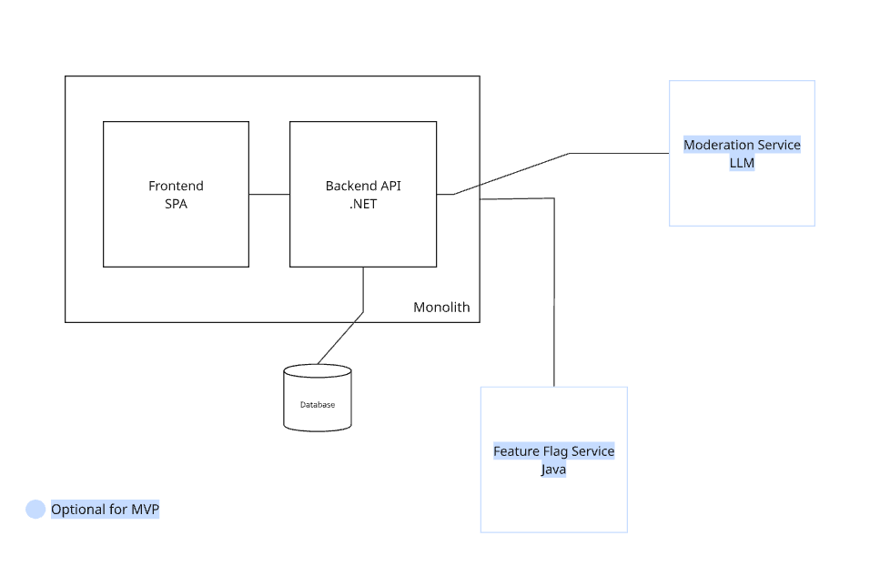

# ADR000 - System Design
___
## Status
Proposed
___
## Context
We need to establish a simple, maintainable system architecture for our application.

___
## Decision
Adopt a monolithic architecture for the core application initially, with a planned addition of microservices in later development phases. This phased approach allows us to establish a stable foundation while maintaining the flexibility to decompose services as requirements become clearer and the codebase matures.

___
## Consequences
- **Pros:** Simpler development and deployment initially, easier debugging and testing, lower operational overhead, clear technology stack, established database patterns
- **Cons:** Potential scalability limitations as the application grows, eventual need for architectural refactoring, risk of tight coupling if not carefully managed

___
## Alternatives Considered
- Full microservices architecture from the start (higher complexity, slower initial development)
- Serverless architecture (vendor lock-in concerns)

___
**Date:** 13.07.2026